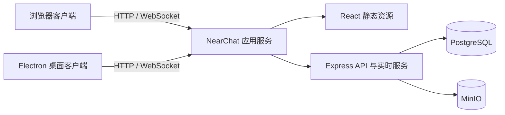

<div align="center">

# 近聊 NearChat

**部署在自己局域网里的轻量团队聊天工具**

账号、消息与文件均由团队自己的 PostgreSQL 和 MinIO 保存，支持浏览器与 Electron 桌面客户端。


</div>


## 项目定位

近聊面向办公室、实验室和离线网络中的小型团队，提供一套可以自行部署、开箱即用的内部沟通工具。当前版本已经覆盖日常团队聊天的核心链路，适合作为**局域网内部可用版本**部署；它不是面向公网、多租户或超大规模集群的即时通信平台。

数据流转范围由你的网络和部署方式决定。应用本身不扫描 IP 或端口，用户发现、在线状态和消息投递均由近聊服务统一完成。

## 核心能力

| 领域       | 已实现能力                                                                   |
| ---------- | ---------------------------------------------------------------------------- |
| 即时沟通   | 单聊、群聊、WebSocket 实时消息、在线状态、敲一下、未读计数、送达与已读回执   |
| 消息能力   | 文本、图片、附件、离线表情、引用回复、圈图回复、全文搜索、限时撤回与失败重试 |
| 文件服务   | MinIO 私有存储、自定义头像与 16 个 GIF 预设、图片预览、原图下载、用户配额    |
| 组织管理   | 管理员创建与停用账号、重置密码、强制退出、操作日志                           |
| 群聊管理   | 群资料、头像颜色、成员管理、群主转让、退出与解散群聊                         |
| 使用体验   | 明亮/黑暗主题、响应式布局、联系人头像投递、通知授权引导、桌面通知、提示音    |
| 桌面客户端 | Electron 系统托盘、原生通知、剪贴板接力、置顶会话浮岛与会话定位              |
| 部署方式   | Docker Compose、本地 Docker 镜像、Rancher/Kubernetes 单文件清单              |

## 界面预览

<table>
  <tr>
    <td width="50%"></td>
    <td width="50%"></td>
  </tr>
  <tr>
    <td align="center">暗色主题与离线表情</td>
    <td align="center">账号、会话与操作日志管理</td>
  </tr>
</table>

<details>
<summary>查看 Electron 首次连接界面</summary>

<p align="center">
  
</p>

</details>

## 系统架构



应用容器同时提供 React 页面、HTTP API 和 WebSocket 服务。PostgreSQL 保存用户、会话、消息与审计数据，MinIO 保存图片及附件；桌面客户端只负责桌面集成，不在用户电脑上运行后端或中间件。

## 快速体验

### 环境要求

- Docker 24+
- Docker Compose v2

### 启动完整服务

```bash
git clone https://github.com/fukang0611/near-chat.git
cd near-chat
docker compose up --build -d
```

启动完成后访问：

- 近聊：<http://localhost:3000>
- MinIO 控制台：<http://localhost:9001>

查看服务状态：

```bash
docker compose ps
docker compose logs -f app
```

本地体验环境会初始化以下账号：

| 用户名  | 密码       | 角色     |
| ------- | ---------- | -------- |
| `admin` | `admin123` | 管理员   |
| `alice` | `alice123` | 普通用户 |
| `bob`   | `bob123`   | 普通用户 |

> 演示密码只用于本机体验。共享到局域网前，请替换 `JWT_SECRET`、MinIO/PostgreSQL 凭据与初始化密码；正式环境建议设置 `SEED_DEMO_USERS=false`。

停止服务：

```bash
docker compose down
```

`docker compose down -v` 会永久删除 PostgreSQL 与 MinIO 数据卷，请仅在明确需要清空数据时执行。

## Rancher / Kubernetes 部署

仓库提供 [Rancher 部署清单](deploy/rancher/near-chat.yaml)。目标环境已经具备 PostgreSQL 和 MinIO 时，只需要构建并导入近聊应用镜像，然后配置：

1. 应用镜像地址。
2. PostgreSQL 连接地址。
3. MinIO 地址、Bucket 与访问凭据。
4. JWT 密钥和初始管理员密码。
5. Ingress 域名或 Rancher Service 暴露方式。

具体步骤见 [Rancher 部署说明](deploy/rancher/README.md)。当前在线状态和 WebSocket 广播保存在单个应用进程中，因此 Deployment 必须保持 `replicas: 1`。

## Electron 桌面客户端

桌面客户端首次启动时填写团队的近聊访问地址，验证通过后会把地址保存在本机。它提供系统托盘、原生通知、服务器切换、窗口生命周期管理、全局剪贴板接力和置顶会话浮岛，并自动读取服务端发布的最新前端页面。

复制文字或图片后按 `Ctrl+Shift+V`（macOS 为 `⌘⇧V`），可在近聊中预览内容、选择联系人并确认发送；快捷键被占用时，也可以从托盘或界面系统信息面板手动打开。

桌面浮岛可从系统信息面板、托盘或应用菜单开启，用一个始终置顶的小窗口查看未读、切换最近会话并快速发送文本；窗口位置和开关会在本机记忆。

```bash
# 开发模式
npm run desktop:start

# 打包当前系统目录版
npm run desktop:package

# 在 Windows x64 构建机生成安装包
npm run desktop:make:win
```

产物位于 `apps/desktop/out/`。更多说明见 [桌面客户端文档](docs/desktop-client.md)。

首次登录后，近聊会显示一次通知用途说明；只有用户点击“开启通知”后才会调用浏览器或操作系统的正式授权框。普通浏览器要求 HTTPS 安全上下文，直接通过局域网 HTTP 地址访问时请使用 Electron 客户端接收系统通知。macOS 原生通知还要求客户端完成代码签名。

## 本地开发

需要 Node.js 20+ 与 Docker。

```bash
docker compose up -d postgres minio
cp .env.example .env
npm install
npm run dev
```

- Vite 开发服务器：<http://localhost:5173>
- API 与 WebSocket 服务：<http://localhost:3000>

常用命令：

```bash
npm run check          # 格式、类型、单元测试与构建
npm run smoke          # 第一阶段核心链路冒烟测试
npm run smoke:phase2   # 文件治理、群管理与账号管理
npm run smoke:phase3   # 回执、搜索、撤回与实时事件
```

## 关键配置

完整配置示例见 [.env.example](.env.example)。

| 变量                            | 默认值          | 用途                  |
| ------------------------------- | --------------- | --------------------- |
| `DATABASE_URL`                  | 本地 PostgreSQL | 业务数据库连接地址    |
| `JWT_SECRET`                    | 仅供本地开发    | 登录令牌签名密钥      |
| `MINIO_*`                       | 本地 MinIO      | 对象存储连接与 Bucket |
| `FILE_MAX_BYTES`                | `52428800`      | 单文件最大 50 MiB     |
| `AVATAR_MAX_BYTES`              | `8388608`       | 用户头像最大 8 MiB    |
| `FILE_USER_QUOTA_BYTES`         | `1073741824`    | 单用户文件配额 1 GiB  |
| `FILE_ORPHAN_TTL_HOURS`         | `24`            | 未发送附件保留时间    |
| `MESSAGE_RECALL_WINDOW_SECONDS` | `120`           | 消息可撤回时限        |
| `SEED_DEMO_USERS`               | `true`          | 是否初始化演示用户    |

## 目录结构

```text
apps/
├── server/      Express、WebSocket、PostgreSQL 与 MinIO 服务
├── web/         React + Vite Web 客户端
└── desktop/     Electron 主进程、预加载桥接与配置界面

deploy/rancher/  Rancher / Kubernetes 部署资源
docs/            方案、桌面端说明、发布记录与截图
scripts/         分阶段端到端冒烟测试
```

## 当前边界

- 面向可信局域网内部团队使用，未按公网 SaaS 的威胁模型设计。
- 当前实时在线状态位于单个应用进程，暂不支持多副本水平扩容。
- 单文件默认上限为 50 MiB，上传流量由应用服务代理。
- 暂不提供端到端加密、音视频通话、消息漫游同步策略或移动原生客户端。
- 通知权限最终由浏览器或操作系统控制；局域网 HTTP 浏览器页面无法申请系统通知。

更完整的需求边界与阶段设计见 [第一阶段整体方案](docs/phase-1-plan.md)。

后续近场协作能力及逐项验收口径见 [近场协作能力路线图](docs/nearby-collaboration-roadmap.md)。
