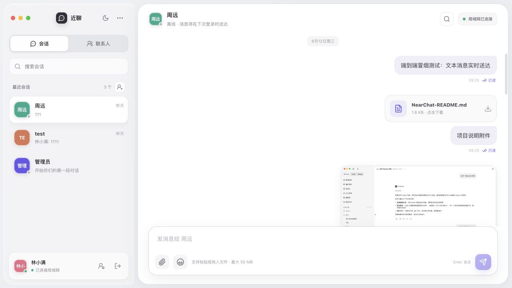
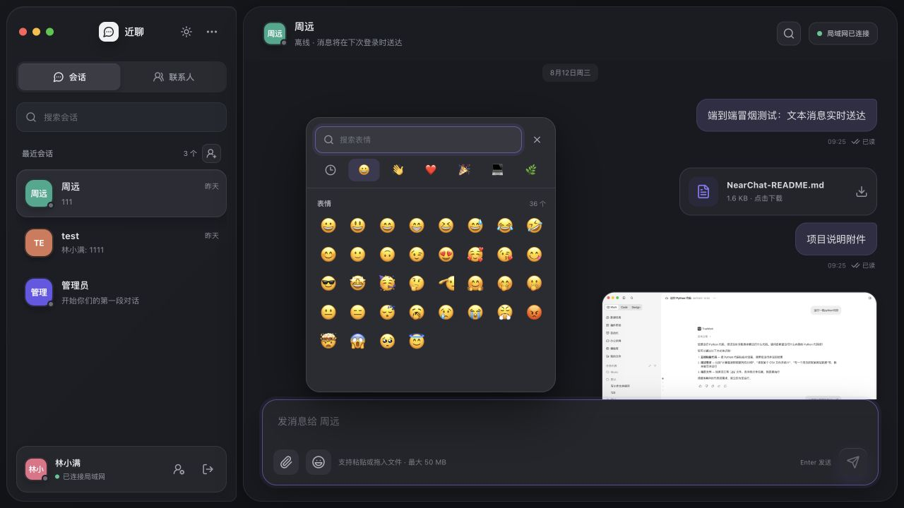
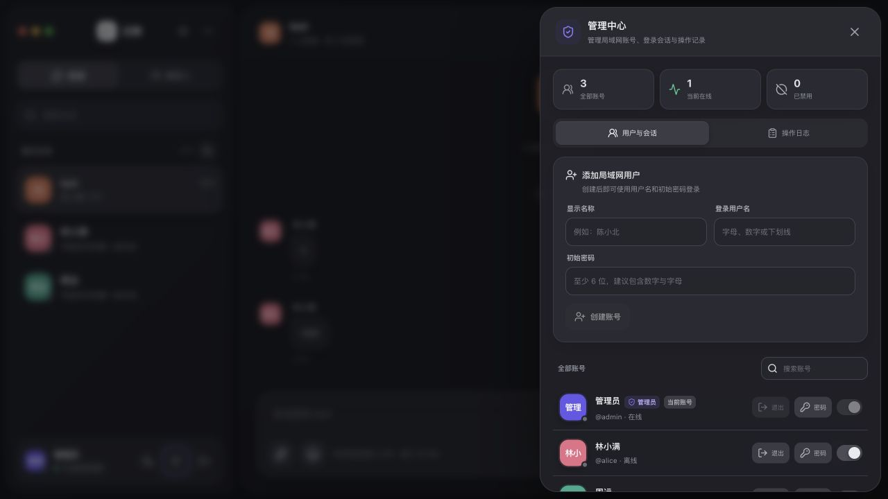
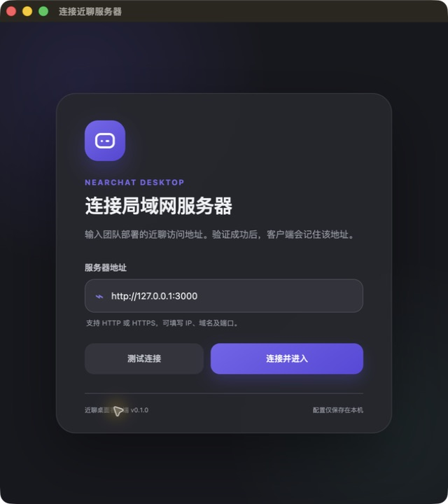
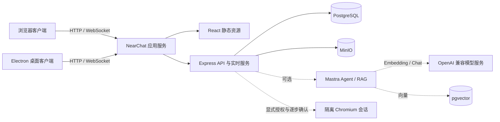

<div align="center">

# 近聊 NearChat

**部署在自己局域网里的轻量团队聊天工具**

账号、消息与文件均由团队自己的 PostgreSQL 和 MinIO 保存，支持浏览器与 Electron 桌面客户端。


</div>



## 项目定位

近聊面向办公室、实验室和离线网络中的小型团队，提供一套可以自行部署、开箱即用的内部沟通工具。当前版本已经覆盖日常团队聊天的核心链路，适合作为**局域网内部可用版本**部署；它不是面向公网、多租户或超大规模集群的即时通信平台。

数据流转范围由你的网络和部署方式决定。应用本身不扫描 IP 或端口，用户发现、在线状态和消息投递均由近聊服务统一完成。

## 核心能力

| 领域       | 已实现能力                                                                                             |
| ---------- | ------------------------------------------------------------------------------------------------------ |
| 即时沟通   | 单聊、群聊、WebSocket 实时消息、在线状态、限时状态气泡、敲一下、未读计数、送达与已读回执               |
| 消息能力   | 文本、图片、附件、语音明信片、表情反应、引用回复、圈图回复、搜索、多类型收藏、多选批量转发、撤回与重试 |
| 文件服务   | MinIO 私有存储、聊天文件库、自定义头像与 16 个 GIF 预设、图片预览、原图下载、用户配额                  |
| 组织管理   | 管理员创建与停用账号、重置密码、强制退出、操作日志                                                     |
| 群聊管理   | 常驻群聊、限时闪聊房间、群资料、成员管理、群主转让、退出与解散                                         |
| 使用体验   | 明亮/黑暗主题、响应式布局、今日团队雷达、头像投递、通知授权引导、桌面通知与提示音                      |
| 桌面客户端 | Electron 系统托盘、原生通知、剪贴板接力、置顶会话浮岛与会话定位                                        |
| AI 知识库  | NearChat 原生知识空间、MinIO 文档、异步索引、Mastra RAG、pgvector 检索、来源定位与带引用问答           |
| 消息 AI    | 会话内总结、待办提取、润色、翻译与分析，支持文档附件、模型切换、结果复制和草稿回填                     |
| 个人助理   | 多助理、独立历史、模型与知识库绑定、文件工作区、自动任务、受控浏览器与完整执行记录                     |
| 部署方式   | Docker Compose、本地 Docker 镜像、Rancher/Kubernetes 单文件清单                                        |

## 界面预览

<table>
  <tr>
    <td width="50%"></td>
    <td width="50%"></td>
  </tr>
  <tr>
    <td align="center">暗色主题与离线表情</td>
    <td align="center">账号、会话与操作日志管理</td>
  </tr>
</table>

<details>
<summary>查看 Electron 首次连接界面</summary>

<p align="center">
  
</p>

</details>

## 系统架构



应用容器同时提供 React 页面、HTTP API 和 WebSocket 服务。PostgreSQL 保存用户、会话、消息与审计数据，MinIO 保存图片及附件；桌面客户端只负责桌面集成，不在用户电脑上运行后端或中间件。Mastra、pgvector 与模型服务均为可选增强层，默认关闭且不参与核心健康检查。

## 可选 AI 增强能力

管理员可在“管理中心 → AI 设置”中即时启用或关闭 AI，无需修改配置文件或重启服务。管理员可以维护多个 OpenAI 兼容对话模型、指定唯一默认项，并单独配置全局 Embedding 服务；普通用户可选择自己的偏好模型，也可以为不同个人助理单独绑定更合适的模型。绑定模型被停用或删除后会自动回退到用户偏好或全局默认模型。

知识库沿用现有账号与文件权限：原文件仍保存在 MinIO，PostgreSQL 保存知识库、来源片段、加密模型设置与持久索引任务，Mastra 负责文档切分、Embedding、pgvector 检索和带来源回答。

侧栏“智能助理”入口提供独立的私人工作台。每个用户最多创建 20 个助理，可从通用、写作、分析和规划预设开始，自定义角色说明与头像颜色，并组合最多 10 个自己的知识库。每个助理拥有最多 30 个文件的独立工作区，可复用聊天文件或单独上传；用户在某轮提问中明确勾选后，服务端才提取受支持文档的文字交给模型，未选择的文件不会被隐式读取。助理回复可由用户显式保存为 Markdown 或 TXT，并继续通过原有 MinIO 权限和配额体系下载、引用与回收。

每个助理还可维护最多 50 个一次、每日或每周自动任务，支持暂停、恢复、编辑、删除和立即执行；任务结果会进入对应助理时间线，并通过站内角标、浏览器或 Electron 系统通知提醒用户。助理配置、对话、文件引用、任务和执行历史均由 NearChat 持久化，服务重启或运行时热重载后仍可继续；Mastra 不接管用户会话数据，也没有自主写文件权限。

受控浏览器按助理默认关闭。用户需分别授权页面读取、截图和表单交互，创建执行时不会立即访问网络，每个打开、读取、截图、点击或填写步骤都要再次确认。服务端只接受页面快照生成的元素编号，不开放任意 CSS、脚本、密码框、文件上传或下载；会话使用独立无痕上下文，完成、取消或空闲超时后立即销毁。目标、脱敏后的页面快照、步骤状态与截图文件均保留在本人助理工作区，便于追踪和复核。

会话消息悬浮操作栏提供“AI 快捷处理”。用户可以对消息正文和 PDF、DOCX、Markdown、HTML、JSON、CSV、纯文本附件进行总结、待办提取、润色、翻译或分析，按次选择模型，并在预览后复制结果或追加到当前输入框。该操作不会修改原消息，也不会自动发送；原文件保留在 MinIO，只有提取后的受限长度文字会发送给模型服务，图片、音频和其他二进制文件不会上传给模型。

- 支持 PDF、DOCX、Markdown、HTML、JSON、CSV 与纯文本。
- 文档异步索引，服务重启后会继续执行，失败可在界面重试。
- 搜索融合语义向量与本地关键词；模型服务瞬时故障时自动回退关键词结果。
- 对话模型可配置多项且必须有一个默认项；用户偏好失效时自动回退默认模型。
- 更换 Embedding 模型、地址、密钥或维度后，系统自动重建向量并重新排队文档。
- 模型密钥使用 AES-256-GCM 加密落库，管理接口只返回“是否已配置”，不回显密钥。
- 问答只使用检索到的片段，并返回原文件和片段位置。
- 个人助理保留最近上下文生成回复，完整时间线按助理隔离保存，并支持清空或删除。
- 自动任务由 PostgreSQL 持久调度，结果写回助理时间线；多副本认领互斥，停机期间不会集中补跑过期周期。
- 助理文件工作区复用同一附件对象，不复制聊天文件；每轮最多显式引用 5 个可提取文档，原始二进制不发送给模型。
- 助理回复只有在用户点击“保存为文件”后才写入 MinIO，支持 Markdown 与 TXT，并沿用个人配额和引用感知回收。
- 消息 AI 处理前再次校验会话成员权限，撤回消息不可处理；结果仅临时预览，由用户确认后写入草稿。
- 未配置 Embedding 时，已配置对话模型的个人助理仍可工作；知识库增强会单独降级。
- 当前为个人私有知识库；共享权限、OCR 与表格结构化解析留待后续版本。
- 当前自动任务只生成文本和引用来源；不会自行启动浏览器或操作页面。
- 受控浏览器默认全局最多 4 个、单用户最多 2 个并发会话，避免 Chromium 抢占局域网服务器资源。

AI 完全可拔插：`AI_ENABLED=false`、模型未配置、pgvector 不可用或模型服务离线时，账号、聊天、文件、收藏、通知和 Electron 客户端均照常工作。只有 AI 功能会隐藏或显示不可用状态；管理员关闭全局 AI 时，已经打开的受控浏览器会话也会立即取消并销毁。

## 快速体验

### 环境要求

- Docker 24+
- Docker Compose v2

### 启动完整服务

```bash
git clone https://github.com/fukang0611/near-chat.git
cd near-chat
docker compose up --build -d
```

启动完成后访问：

- 近聊：<http://localhost:3000>
- MinIO 控制台：<http://localhost:9001>

查看服务状态：

```bash
docker compose ps
docker compose logs -f app
```

本地体验环境会初始化以下账号：

| 用户名  | 密码       | 角色     |
| ------- | ---------- | -------- |
| `admin` | `admin123` | 管理员   |
| `alice` | `alice123` | 普通用户 |
| `bob`   | `bob123`   | 普通用户 |

> 演示密码只用于本机体验。共享到局域网前，请替换 `JWT_SECRET`、MinIO/PostgreSQL 凭据与初始化密码；正式环境建议设置 `SEED_DEMO_USERS=false`。

停止服务：

```bash
docker compose down
```

`docker compose down -v` 会永久删除 PostgreSQL 与 MinIO 数据卷，请仅在明确需要清空数据时执行。

## Rancher / Kubernetes 部署

仓库提供 [Rancher 部署清单](deploy/rancher/near-chat.yaml)。目标环境已经具备 PostgreSQL 和 MinIO 时，只需要构建并导入近聊应用镜像，然后配置：

1. 应用镜像地址。
2. PostgreSQL 连接地址。
3. MinIO 地址、Bucket 与访问凭据。
4. JWT 密钥和初始管理员密码。
5. Ingress 域名或 Rancher Service 暴露方式。

具体步骤见 [Rancher 部署说明](deploy/rancher/README.md)。当前在线状态和 WebSocket 广播保存在单个应用进程中，因此 Deployment 必须保持 `replicas: 1`。

## Electron 桌面客户端

桌面客户端首次启动时填写团队的近聊访问地址，验证通过后会把地址保存在本机。它提供系统托盘、原生通知、按需麦克风授权、服务器切换、窗口生命周期管理、全局剪贴板接力和置顶会话浮岛，并自动读取服务端发布的最新前端页面。

复制文字或图片后按 `Ctrl+Shift+V`（macOS 为 `⌘⇧V`），可在近聊中预览内容、选择联系人并确认发送；快捷键被占用时，也可以从托盘或界面系统信息面板手动打开。

桌面浮岛可从系统信息面板、托盘或应用菜单开启，用一个始终置顶的小窗口查看未读、切换最近会话并快速发送文本；窗口位置和开关会在本机记忆。

```bash
# 开发模式
npm run desktop:start

# 打包当前系统目录版
npm run desktop:package

# 在 Windows x64 构建机生成安装包
npm run desktop:make:win
```

产物位于 `apps/desktop/out/`。更多说明见 [桌面客户端文档](docs/desktop-client.md)。

首次登录后，近聊会显示一次通知用途说明；只有用户点击“开启通知”后才会调用浏览器或操作系统的正式授权框。普通浏览器要求 HTTPS 安全上下文，直接通过局域网 HTTP 地址访问时请使用 Electron 客户端接收系统通知。macOS 原生通知还要求客户端完成代码签名。

## 本地开发

需要 Node.js 22.13+ 与 Docker。

```bash
docker compose up -d postgres minio
cp .env.example .env
npm install
npm run dev
```

- Vite 开发服务器：<http://localhost:5173>
- API 与 WebSocket 服务：<http://localhost:3000>

常用命令：

```bash
npm run check          # 格式、类型、单元测试与构建
npm run smoke          # 第一阶段核心链路冒烟测试
npm run smoke:phase2   # 文件治理、群管理与账号管理
npm run smoke:phase3   # 回执、搜索、撤回与实时事件
```

## 关键配置

完整配置示例见 [.env.example](.env.example)。

| 变量                               | 默认值          | 用途                                       |
| ---------------------------------- | --------------- | ------------------------------------------ |
| `DATABASE_URL`                     | 本地 PostgreSQL | 业务数据库连接地址                         |
| `JWT_SECRET`                       | 仅供本地开发    | 登录令牌签名密钥                           |
| `MINIO_*`                          | 本地 MinIO      | 对象存储连接与 Bucket                      |
| `FILE_MAX_BYTES`                   | `52428800`      | 单文件最大 50 MiB                          |
| `AVATAR_MAX_BYTES`                 | `8388608`       | 用户头像最大 8 MiB                         |
| `FILE_USER_QUOTA_BYTES`            | `1073741824`    | 单用户文件配额 1 GiB                       |
| `FILE_ORPHAN_TTL_HOURS`            | `24`            | 未发送附件保留时间                         |
| `MESSAGE_RECALL_WINDOW_SECONDS`    | `120`           | 消息可撤回时限                             |
| `SEED_DEMO_USERS`                  | `true`          | 是否初始化演示用户                         |
| `AI_SETTINGS_ENCRYPTION_KEY`       | 回退到 JWT 密钥 | 模型密钥的持久加密密钥，部署后不可随意更换 |
| `AI_ENABLED`                       | `false`         | 首次建库时的 AI 开关引导值                 |
| `AI_BASE_URL` / `AI_API_KEY`       | 空              | 首次建库时的 OpenAI 兼容服务引导值         |
| `AI_CHAT_MODEL`                    | 空              | 首次创建的默认对话模型                     |
| `AI_EMBEDDING_MODEL`               | 空              | 首次创建的全局向量模型                     |
| `AI_EMBEDDING_DIMENSIONS`          | `1536`          | 首次创建的向量输出维度                     |
| `AI_ASSISTANT_TASK_POLL_MS`        | `1000`          | 个人助理任务调度轮询间隔（毫秒）           |
| `AI_BROWSER_EXECUTABLE_PATH`       | 镜像内置路径    | Chromium 可执行文件路径                    |
| `AI_BROWSER_*_TIMEOUT_MS`          | `20000/10000`   | 页面导航与单步操作超时（毫秒）             |
| `AI_BROWSER_MAX_SESSIONS`          | `4`             | 全局同时运行的浏览器会话上限               |
| `AI_BROWSER_MAX_SESSIONS_PER_USER` | `2`             | 单用户同时运行的浏览器会话上限             |
| `AI_BROWSER_SESSION_TTL_MINUTES`   | `15`            | 浏览器会话空闲回收时间                     |

## 目录结构

```text
apps/
├── server/      Express、WebSocket、PostgreSQL 与 MinIO 服务
├── web/         React + Vite Web 客户端
└── desktop/     Electron 主进程、预加载桥接与配置界面

deploy/rancher/  Rancher / Kubernetes 部署资源
docs/            方案、桌面端说明、发布记录与截图
scripts/         分阶段端到端冒烟测试
```

## 当前边界

- 面向可信局域网内部团队使用，未按公网 SaaS 的威胁模型设计。
- 当前实时在线状态位于单个应用进程，暂不支持多副本水平扩容。
- 单文件默认上限为 50 MiB，上传流量由应用服务代理。
- 暂不提供端到端加密、音视频通话、消息漫游同步策略或移动原生客户端。
- 通知权限最终由浏览器或操作系统控制；局域网 HTTP 浏览器页面无法申请系统通知。
- AI 知识库要求 PostgreSQL 安装 `vector` 扩展；未满足时仅 AI 降级，核心服务仍可用。
- 浏览器页面状态只保存在隔离的内存会话中；服务重启或空闲超时后执行会标记过期，历史步骤与截图仍可查看。

更完整的需求边界与阶段设计见 [第一阶段整体方案](docs/phase-1-plan.md)。

后续近场协作能力及逐项验收口径见 [近场协作能力路线图](docs/nearby-collaboration-roadmap.md)。
