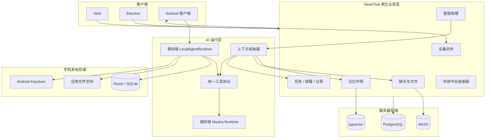

# 记忆、移动助理与外部连接器实施方案

本文档记录 NearChat 在现有局域网聊天、知识库和个人智能助理基础上的下一阶段设计。
目标是逐步形成同时支持团队协作和个人离线使用的双模系统，同时确保模型、Embedding、
移动端或外部连接器不可用时，当前聊天、文件、收藏和 Electron 客户端不受影响。

## 1. 产品目标

NearChat 后续提供四种运行状态：

| 状态     | NearChat 服务器 | 互联网 | 核心能力                                     |
| -------- | --------------- | ------ | -------------------------------------------- |
| 团队模式 | 已连接          | 可选   | 聊天、群组、共享文件、团队知识库和智能助理   |
| 个人模式 | 未连接          | 可用   | 本地记忆、任务、提醒、记录和远程 LLM 助理    |
| 完全离线 | 未连接          | 不可用 | 本地检索、记忆、任务和提醒；远程模型暂不可用 |
| 混合模式 | 重连服务器      | 可选   | 增量同步允许同步的个人数据并恢复团队聊天     |

“离线可用”首先表示不依赖 NearChat 服务器。完全没有互联网时，Room FTS 关键词检索、
任务、提醒和记录继续可用；远程 LLM 与 Embedding 请求需要等待网络恢复。端侧模型不在
首个移动版本范围内。

## 2. 总体架构



### 2.1 核心原则

- 原始聊天、任务、文件和用户记录是事实来源，AI 记忆是可重建、可追溯的派生数据。
- NearChat 持有账号、权限、来源和同步状态，Mastra 只负责推理、工具调用和上下文组织。
- 私人记忆默认仅本人可见；群聊公开回复绝不能隐式使用其他会话或私人记忆。
- 移动端采用本地优先模式，界面始终读取本地数据库，网络只负责同步本地事实来源。
- 对话模型和 Embedding 均为可选依赖；不可用时分别降级为无生成能力和关键词检索。
- 外部平台连接器是可插拔模块，连接失败不能影响 NearChat 服务健康状态。

## 3. 记忆中枢

### 3.1 短期记忆

短期记忆保存最近 7 天的事件型观察，包括近期讨论、临时约束、未解决问题、决定、待办和
近期使用的资料。它采用追加模式，超过 7 天后退出默认模型上下文，但不会删除原始消息。

建议表：`memory_observations`。

主要字段：

- `owner_user_id`
- `scope_type`：`PRIVATE` 或 `CONVERSATION`
- `conversation_id`
- `kind`
- `content`
- `importance`
- `observed_at`
- `expires_at`
- `status`
- `revision`

### 3.2 长期记忆

长期记忆保存用户偏好、人物关系、项目背景、长期目标、重要决定和固定流程。长期记忆不是
无限追加相似文本，而是围绕一个规范化条目进行版本演进。

支持的变更类型：

- `CREATE`：创建新条目。
- `APPEND`：补充信息。
- `CORRECT`：纠正错误内容。
- `MERGE`：合并重复条目。
- `SUPERSEDE`：由新结论替代。
- `FORGET`：按用户要求遗忘。

建议表：

| 表                  | 用途                             |
| ------------------- | -------------------------------- |
| `memories`          | 长期记忆当前版本                 |
| `memory_revisions`  | 追加式版本历史                   |
| `memory_sources`    | 原消息、文件、任务和助理对话来源 |
| `memory_candidates` | AI 建议但尚未确认的记忆          |
| `memory_jobs`       | 异步提炼、合并和索引任务         |
| `memory_settings`   | 用户自动记忆和检索偏好           |

### 3.3 作用域与来源

第一阶段仅提供私人记忆和会话记忆，不自动创建团队共享记忆。每条记忆保留来源类型、来源
标识、会话标识、摘录和来源时间。打开来源时再次校验当前用户权限；界面隐藏入口不能替代
服务端授权。

### 3.4 生成策略

- 用户明确说“记住这个”时立即创建手动记忆或待确认候选。
- 普通消息发送不等待记忆处理，后台 Worker 按会话批量提炼。
- 推荐在累计 20 条新消息或会话静默 5 分钟后生成一次短期观察。
- 高置信度、重复出现或用户明确确认的内容才升级为长期记忆。
- 长期记忆写入前执行规范键和语义相似度去重，冲突内容进入待确认队列。

### 3.5 检索与上下文

助理按以下顺序构造模型上下文：

1. 当前线程最近消息。
2. 最近 7 天相关短期观察。
3. 相关长期记忆。
4. 当前会话上下文。
5. 助理绑定知识库。
6. 用户本轮明确选择的文件。
7. 工具按需检索的跨会话原始消息。

服务器使用独立的 pgvector 记忆索引，向量只保存可重建表示；PostgreSQL 原生表保存内容、
权限和来源。Embedding 不可用时退回关键词、时间和类型查询。

## 4. 智能助理与聊天集成

### 4.1 原生助理工具

- `search_chat_messages`
- `read_conversation_context`
- `search_memories`
- `get_memory_source`
- `search_favorites`
- `search_chat_files`
- `create_memory_candidate`
- `create_personal_task`
- `complete_personal_task`
- `create_reminder`
- `create_personal_record`

每次工具调用由服务端注入真实的 `requesterUserId`、`assistantId`、`invocationId` 和允许访问的
作用域。工具不得接受模型自行声明的用户身份或扩大后的会话范围。

### 4.2 助理授权

新增 `assistant_tool_grants`，分别控制当前会话检索、跨会话检索、私人记忆读取、收藏和文件
检索以及任务、提醒和记忆写入。默认只开放当前助理线程和本次显式选择的会话。

### 4.3 聊天中的助理调用

编辑器的 `@` 菜单分组展示会话成员和本人的智能助理。发送接口携带结构化的助理 Mention，
避免服务端依赖纯文本解析。

执行记录保存到 `assistant_invocations`，状态为：

```text
QUEUED -> RUNNING -> WAITING_CONFIRMATION -> SUCCEEDED / FAILED
```

首版提供：

- `PRIVATE_PREVIEW`：结果只对发起人可见，确认后回填输入框、创建事项或发送。
- `CONVERSATION_REPLY`：作为正式会话消息发送，当前成员均可见。

公开回复只允许使用当前会话的公开上下文。现有消息表可增加 `actor_type`、
`actor_assistant_id` 和 `invocation_id`，同时保留 `sender_id` 追踪真实发起用户。

## 5. 个人事务域

现有自动任务与提醒依赖助理和线程，无法直接用于未连接服务器的手机。新增通用实体：

| 实体                    | 说明                          |
| ----------------------- | ----------------------------- |
| `personal_tasks`        | 普通待办、截止时间和完成状态  |
| `personal_reminders`    | 不依赖助理的本地或服务器提醒  |
| `personal_records`      | Markdown 个人记录、日志和备忘 |
| `assistant_automations` | 需要模型或工具执行的自动任务  |

现有 `ai_assistant_reminders` 后续迁移到通用提醒，并保留可选的助理、线程和来源定位。

## 6. Android 客户端

### 6.1 技术方案

- React + Vite：复用现有技术栈和基础组件。
- Capacitor：Android 容器与原生插件桥接。
- Kotlin + Room：结构化本地数据、迁移和全文检索。
- WorkManager：增量同步和可延迟后台任务。
- Android Keystore：对话模型和 Embedding API Key。
- Local Notifications：任务与提醒通知。

建议增加：

```text
apps/mobile/
packages/contracts/
packages/domain/
packages/agent-protocol/
packages/ui-shared/
```

### 6.2 移动端 Agent Runtime

Mastra 保留在服务端。移动端实现轻量 `LocalAgentRuntime`，直接调用用户配置的 OpenAI 兼容
接口，并与服务端共享请求、工具和结果协议。

```ts
interface AgentRuntime {
  generate(request: AgentRequest): Promise<AgentResponse>;
  embed?(texts: string[]): Promise<number[][]>;
  executeTool(call: ToolCall): Promise<ToolResult>;
}
```

手机使用 Room 保存助理、对话、记忆、任务、提醒、记录、同步游标和离线操作；API Key 只
进入 Android Keystore。首个版本的本地检索以 Room FTS4 为准；Agent 协议保留 Embedding
接口，但向量持久化与端侧相似度索引不属于本轮实现。

### 6.3 首版边界

- 不包含端侧大模型。
- 本轮不同步或缓存团队聊天；断开服务器后继续使用的是七类个人与助理实体。
- 不在首版同步全部历史附件，只按需下载或上传。
- 不在后台精确执行长时间 AI 任务；普通提醒使用系统通知，WorkManager 只负责持久 outbox 的
  延迟推送，模型生成仍在用户打开客户端时执行。

## 7. 设备同步

新增 `sync_devices`、`sync_entity_snapshots`、`sync_operations`、`sync_changes` 和
`sync_cursors`。手机离线写入本地数据库和 outbox，连接恢复后批量推送；服务器通过
`ownerId + operationId + request fingerprint` 保证幂等并拒绝同标识复用为不同请求。

主要接口：

```text
POST /api/sync/devices/register
POST /api/sync/bootstrap
POST /api/sync/push
GET  /api/sync/pull?cursor=...&limit=...
POST /api/sync/memory-conflicts/:operationId/resolve
```

`bootstrap` 使用服务端签名的续传令牌分页执行投影回填和快照下发，并在第一页冻结
watermark；只有完整末页才提交初始 cursor，随后立即通过 `pull` 收敛分页期间产生的写入。
`bootstrap`、`pull` 和 `push` 都按最终 UTF-8 JSON 字节预算分批，避免合法的大消息历史形成
无法恢复的 413 或移动端内存峰值。

第一版同步记忆、个人任务、提醒、记录、助理配置、助理线程和纯文本消息。模型密钥、浏览器
运行态、大体积附件全集和未明确选择的聊天历史不进入同步协议。

冲突规则：

- 完成状态单调推进，旧离线版本不能恢复已完成事项。
- 删除记录保留至少 30 天 tombstone。
- 长期记忆并发修改生成待合并版本，不静默覆盖。
- 助理消息按 UUID 追加和去重。
- 排序以服务器接收时间和 revision 为准，不依赖设备时钟。

## 8. 微信与钉钉连接器

新增可插拔连接器层：

```text
apps/server/src/connectors/
  connector-provider.ts
  connector-service.ts
  connector-worker.ts
  dingtalk-connector.ts
  wecom-callback.ts
```

建议表：`connector_configs`、`connector_bindings`、`connector_identities`、
`connector_events`、`connector_message_links` 和 `connector_delivery_jobs`。

### 8.1 钉钉

优先采用官方 Stream SDK：服务器主动建立长连接，无需局域网服务暴露公网回调地址。第一版
处理机器人私聊、群聊 Mention、文本回复和任务结果推送；后续再接钉钉待办、日历或官方 MCP。

### 8.2 企业微信

先使用群机器人 Webhook 推送提醒、任务结果和摘要；双向消息使用企业自建应用回调，需要
具备可由企业微信访问的 HTTPS 地址。连接条件不满足时只关闭该连接器。

### 8.3 个人微信

首版不承诺个人微信双向聊天接入，不采用注入、Hook 或桌面 RPA。移动端优先支持 Android
系统分享入口和从 NearChat 分享到微信；后续只基于当时可用的官方开放能力评估。

## 9. 界面设计

Web 和 Electron 的智能助理工作区增加“记忆”入口，并继续保留对话、任务、日程、文件和
浏览器。记忆中心支持短期/长期切换、来源筛选、搜索、原消息定位、编辑、删除、置顶和候选
确认。聊天输入器提供助理 Mention 与紧凑执行状态，不使用持续占据内容区的大通知条。

Android 首版底部导航提供“助理、记忆、任务、记录、我的”；团队会话与联系人
不在本轮移动端范围。所有页面明确显示个人模式、已连接团队、离线、正在同步和存在冲突等状态。

## 10. 实施阶段

| 阶段 | 交付内容                                        | 状态                               |
| ---- | ----------------------------------------------- | ---------------------------------- |
| 0    | 有序数据库迁移、共享协议和 Agent Runtime 基础   | 已完成                             |
| 1    | 手动记忆、7 天短期记忆、自动候选和混合检索      | 已完成                             |
| 2    | 跨会话工具、聊天 Mention、私人预览和公开回复    | 已完成                             |
| 3    | Capacitor Android、Room、本地助理与离线事务能力 | 源码与原生编译完成，待实机验收     |
| 4    | 设备注册、增量同步、冲突和 tombstone            | 代码与实库集成完成，待双设备验收   |
| 5    | 钉钉 Stream、企业微信推送与双向连接器           | 代码与协议测试完成，待企业凭据验收 |

每个阶段的源码交付必须完成类型检查、单元测试和生产构建；需要设备、签名、公网回调或企业
凭据的验收单独记录，不用“构建通过”代替。Android 安装包、签名和正式发布按本轮约定延后，
等待后续功能完成后统一进行。本轮不要求创建提交或推送远端。

### 10.1 阶段 1 当前进度

- 1A 已完成：原生长期记忆、来源快照、版本修订、并发版本校验和软遗忘。
- 1B 已完成：7 天短期记忆、聊天消息“记住”入口、明确“记住 / 记一下”意图的异步候选、
  候选忽略/转短期/转长期、个人识别开关，以及独立记忆向量索引。
- 检索已实现可拔插混合模式：Embedding 可用时组合语义与字面命中；AI 关闭、超时或模型
  故障时在 1.8 秒内降级为关键词检索，聊天和记忆写入不受影响。
- 1C 已完成：用户主动开启后，按“累计 20 条消息或静默 5 分钟”形成持久批次；默认模型
  后台提取候选，严格 JSON 校验后才写入待确认箱。相同或高度相近候选会合并，候选和已
  接受记忆均可定位原消息，7 天短期记忆由独立作业归档。
- 自动整理默认关闭。AI 未配置、全局关闭或暂时不可用时不会认领模型任务，普通聊天、
  手动记忆、明确“记住…”规则、候选确认和关键词检索不受影响。

### 10.2 阶段 2 当前进度

- 2A 已完成：个人助理可按助理分别授权 `search_chat_messages` 与 `search_memories`；两项
  默认关闭，真实用户、调用标识和当前有权访问的会话范围由服务端注入，模型参数中不包含
  可伪造的用户身份或权限范围。
- 工具仅挂载到私人助理执行。`CONVERSATION_REPLY` 模式在工具工厂中强制移除跨会话与
  私人记忆工具，为后续群聊公开回复保留服务端硬边界。
- 工具实际使用过的聊天和记忆来源随助理回复持久化；暗色与明亮主题均使用紧凑来源标签，
  可定位原消息或打开指定的长期/短期记忆。授权关闭后，后续调用立即不再获得对应工具。
- 2B 已完成：聊天输入器通过结构化菜单选择本人助理，服务端在消息事务内创建幂等的
  `assistant_invocations`，后台状态机负责认领、超时恢复、失败记录和私人预览生成。
- 预览仅发起者可见，可继续编辑、丢弃或明确确认；只有确认后才创建并广播带助理身份快照
  的正式消息。公开回复只使用当前会话最多 30 条受限上下文和附件名称，服务端强制移除
  跨会话与私人记忆工具，并使用不含个人自定义说明和知识库绑定的公开助理角色。
- AI 未配置、关闭或故障时，Mention 会呈现可恢复的失败状态，普通聊天发送链路保持独立；
  明亮、暗色和窄屏布局均已覆盖，真实模型冒烟测试验证了预览、信息隔离和确认发布流程。

### 10.3 阶段 3–5 当前进度

- 阶段 3：新增 `apps/mobile` Capacitor Android 工程；Room v3 使用七类结构化领域表、FTS4、
  outbox、冲突和游标表，本地提醒由 Local Notifications 调度。模型与团队凭据通过 Android
  Keystore AES-GCM 保护；正式构建强制 HTTPS，调试构建使用 HTTP 时显示明文风险。移动端
  `LocalAgentRuntime` 共享 Agent/Tool 协议，并通过显式授权工具检索本地记忆。
- 阶段 4：服务端提供设备注册、签名令牌分页 bootstrap、幂等 push 与按字节预算分页的游标
  pull；bootstrap 冻结 watermark，只有快照完整下发后才提交初始 cursor。七类实体直接写入
  真实业务表并在同一事务生成快照和增量，不再形成 JSON 快照与业务表双事实源；同一 owner
  的同步水位与业务投影按固定锁序提交，避免并发事务造成游标永久漏增量。完成状态单调推进，
  长期记忆并发更新保留待合并稿，助理层级删除会为消息、线程和助理生成 tombstone。
  WorkManager 可在 WebView 未运行时推送持久 outbox，冲突和拉取由前台按权威版本收敛。
- 阶段 5：钉钉使用 `dingtalk-stream` 的机器人 CALLBACK，事件事务提交后才 ACK；企业微信同时
  支持官方群机器人 Webhook 推送和自建应用签名验证、AES-CBC 回调解密及应用消息回复。身份、
  会话绑定、消息关联、事件结果缓存、事务 outbox、lease 恢复和幂等投递均持久化；失败事件
  与投递任务可在管理中心分页查看、重试或取消，所有写操作进入审计日志。任务、AI 提醒和
  通用个人提醒都能按绑定进入连接器投递队列。企业微信双向回调只使用服务端根据
  `PUBLIC_BASE_URL` 生成的规范 HTTPS 地址，不从管理员当前访问的浏览器地址猜测公网入口。
- 自动化验证已覆盖 TypeScript 类型检查、单元测试、生产 Web/Server/Mobile Web 构建、
  Android Kotlin/Room 单元测试与 instrumentation 源码编译，以及临时全新 PostgreSQL 从 v1
  到 v9 的迁移和七类同步、冲突、级联删除、唯一 revision、提醒 outbox 与同步投影。
- 尚需使用两台 Android 实机和企业钉钉/企业微信凭据、公网 HTTPS 回调完成真实闭环验收；
  这些设备、地址与凭据不进入仓库，也不会在普通构建期要求提供。安装包、签名与发布继续按
  本轮约定延期。

## 11. 必须验收的场景

1. 一周前后的短期记忆边界准确，原始聊天不受影响。
2. 长期记忆补充、纠正和遗忘不产生重复活跃条目。
3. 助理能检索跨会话决定并定位原消息。
4. 群聊公开回复不会带出私人记忆。
5. 用户失去会话权限后不能继续检索该会话原始记录。
6. AI 和 Embedding 关闭后，手动记忆、任务和提醒仍然可用。
7. APK 首次安装时不配置服务器也能创建助理、记录和提醒。
8. 手机完全断网并重启后仍能检索、完成任务和接收本地提醒。
9. 多设备并发修改能够报告冲突，不静默覆盖。
10. 外部平台重复事件不会产生重复回复、记忆或任务。
